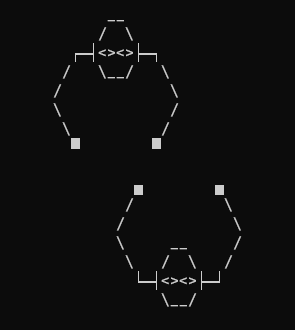

# iPunchIt :punch:

## Jogo de boxe 

## em C# no console! :technologist::nerd_face: 

Ainda está em desenvolvimento, o objetivo do jogo é puramente educacional por isso o codigo está ricamente comentado

Eu usei uma biblioteca externa, um pacote NuGet, para fazer o menu, então se você quiser compilar, modificar e continuar desenvolvendo até virar um jogo funcional você vai ter que instalar:disappointed:

:heavy_check_mark: O jogo já tem um menu

:heavy_check_mark: O jogo já desenha os sprites na tela, melhor dizendo imprime 

:heavy_check_mark: O jogo já tem movimentação dos personagems 

:heavy_check_mark:O jogo já tem a captura de comandos do teclado.

:x:O jogo ainda não tem uma implementação gráfica das barras de vida 

:x:O jogo ainda não captura colisão

:x:O jogo ainda não desenha perfeitamente os em todas posições sprites

:x:O jogo ainda não tem uma 🤖 IA para o usuário joga contra.

## Então só falta um pouquinha pra acabar :pinching_hand: :trollface:

